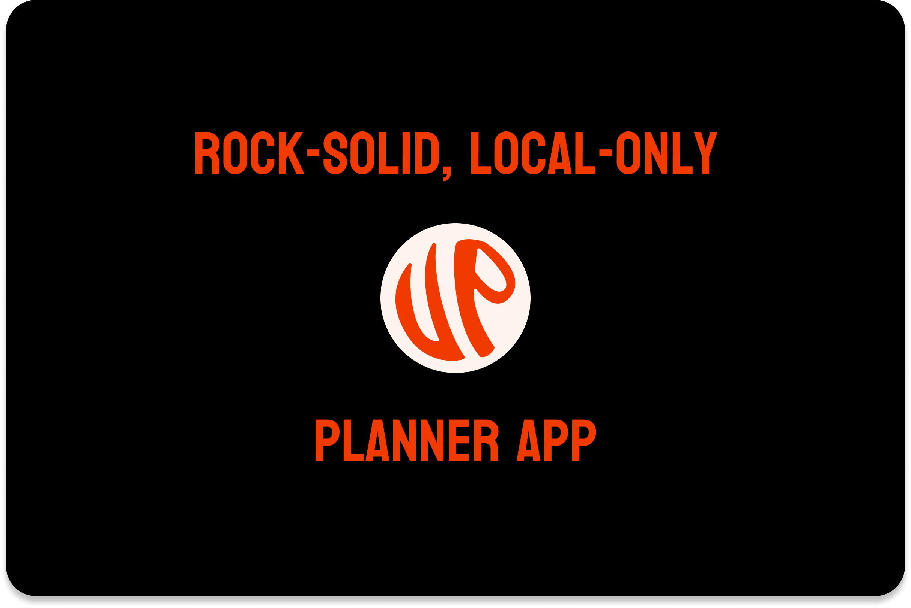
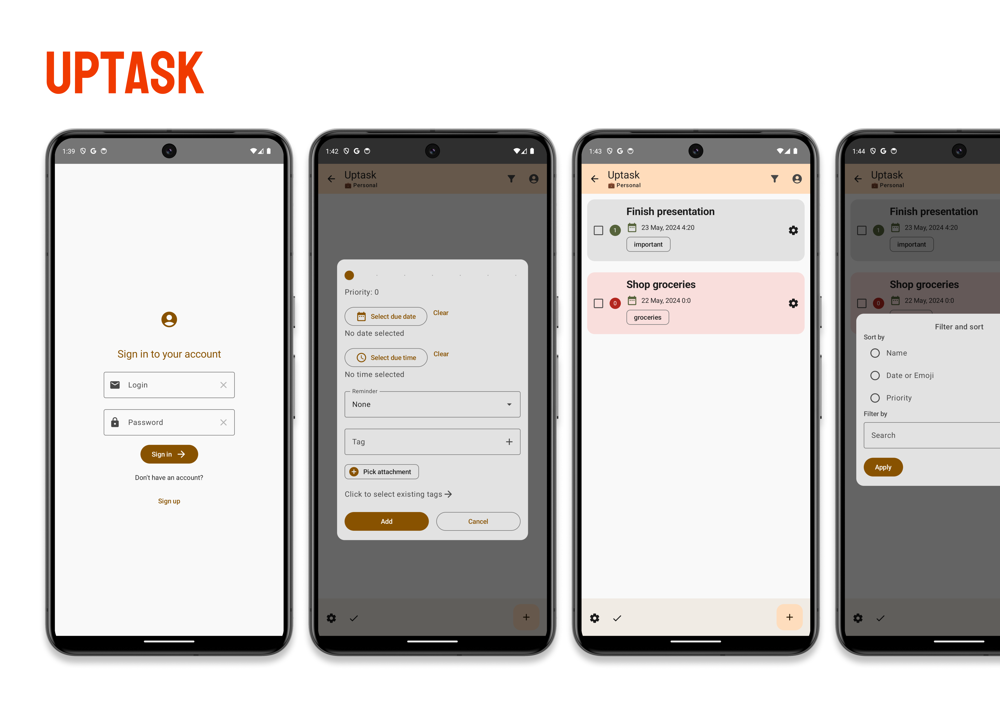

# ☑️ uptask

Welcome to `uptask`, intuitive **task management app** with dynamic Material You design!

## Platforms

uptask is an Android app, written on `Kotlin + Jetpack Compose`. 
Data organization implemented through the `H2` engine and a framework `Exposed`.

## Description

Uptask is built from the ground up, and from the day one it was planned 
as a private space for planning.
Therefore it doesn't have such convenient feature as synchronizing.
Nevertheless, uptask is completely safe and secure as well as absolutely free! (even if you are a company)
This way it provides the most independent experience.

## Features

* Local accounts system (registration and authorization)
* Projects or task lists (name and emoji)
* Powerful task management (name, description, tags and priority, due dates)
* Flexible sorting (by name, priority, due date)
* Full-text search (description and name)
* Various stats for the time period
* Profile editing
* Extended reminders
* Immediate and versatile data export

## Screenshots

## Roadmap

* Localization into more languages
* Calendar integration

[🇷🇺](README.md)
