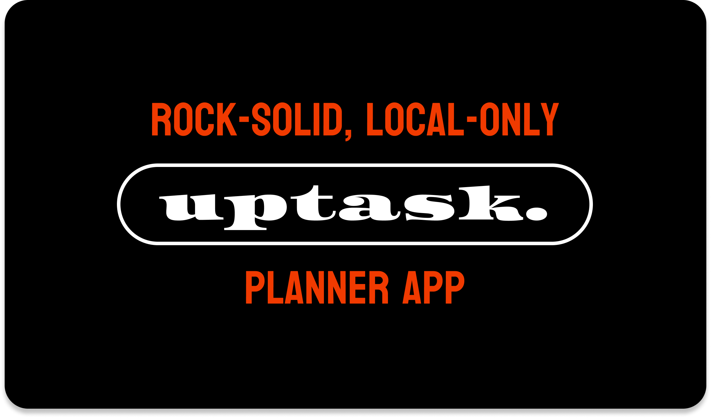
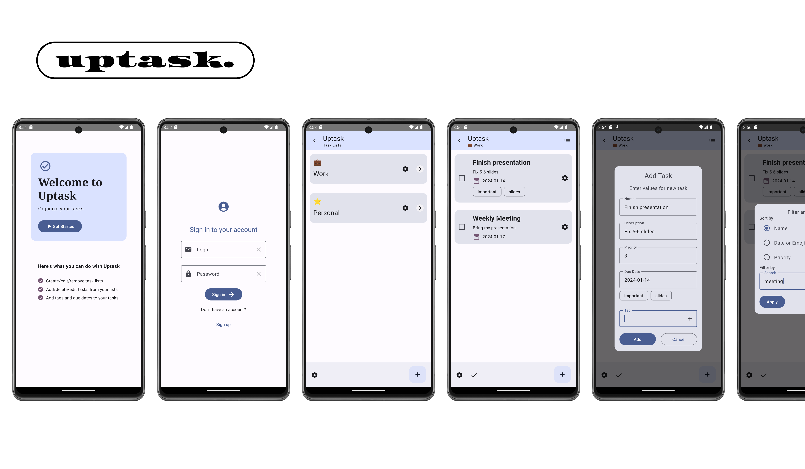

# ☑️ uptask.

Добро пожаловать в `uptask.`, интуитивный **планировщик задач** с Material You дизайном!

## Платформы

uptask это Android приложение, написанное на `Kotlin + Jetpack Compose`. 
Организация данных выполнена при помощи базы данных `H2` и фреймворка `Exposed`.

## Функции

* Локальная система аккаунтов (регистрация и авторизация)
* Проекты или списки задач (название и эмодзи)
* Комплексная структура задач (название, описание, теги и приоритет, дедлайны)
* Гибкая сортировка (по имени, приоритету или дедлайну)
* Полный поиск (описание и название задачи)
* Статистика по задачам за временной период
* Редактирование профиля и очистка БД

## Скриншоты

## Дорожная карта

* Локализация на большее количество языков
* Напоминания
* Оптимизация
* Интеграция с системным календарем

[🇬🇧](README-en.md)
